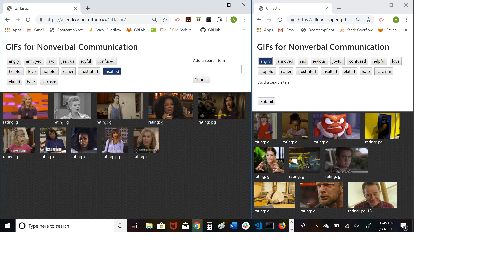

# GifTastic
Application using GIPHY API to load a set of 10 GIFs based on search terms clicked by user

[https://allendcooper.github.io/GifTastic/](https://allendcooper.github.io/GifTastic/)

## Overview
* Uses JavaScript and jQuery to build the following:
    1. A variable (topics) to store an array of topics that will serve as search words for GIFs
    2. A function (printTopics) to render a button on the page for each topic in the topics array 
    3. A function (returnGifs) that uses the ajax method to access the GIPHY API and get 10 GIFs for the given topic, and then append them to the page
    4. A click handler for the search buttons to call the returnGifs function for the search word associated with the button clicked
    5. A click handler for a form that allows users to add their own custom search button

* Uses an html document with several elements, identified with unique IDs and classes, so that jQuery can print to them

* Uses CSS to design the document, including BootStrap styles,  background image, and mobile responsiveness 

### Functionality
